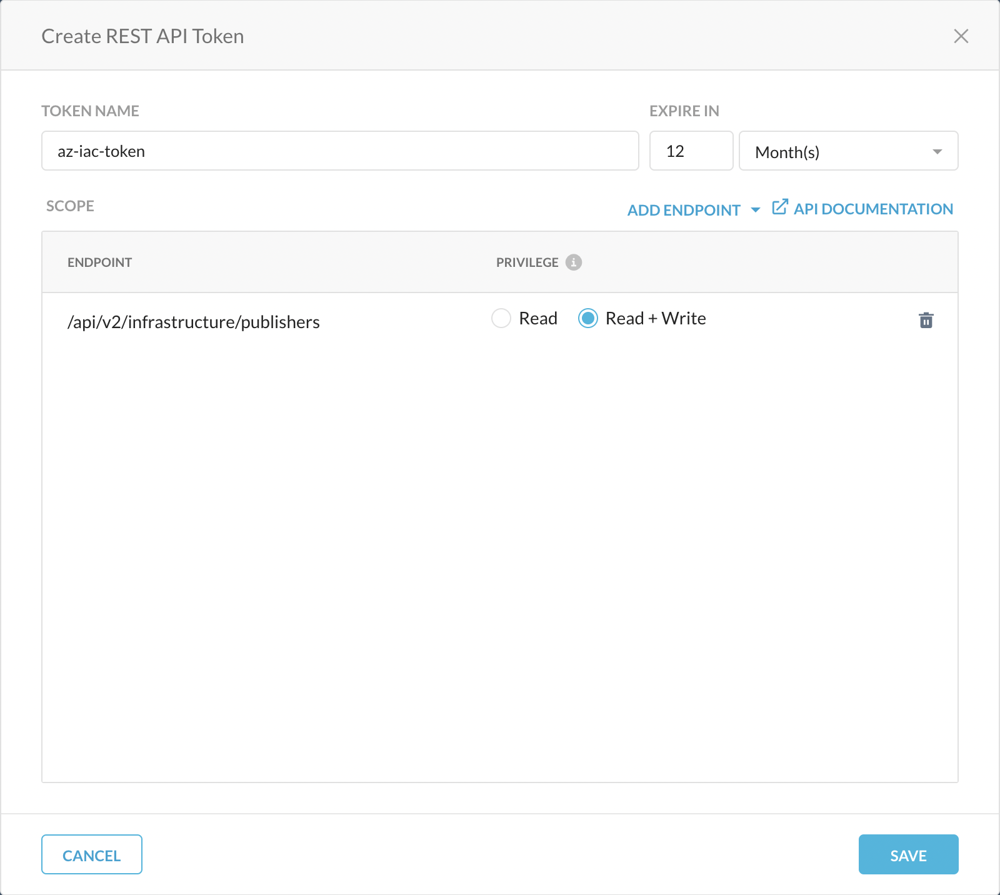

# Quick Start Guide

Get your Netskope Private Access Publishers deployed on Azure with multi-AZ redundancy.

## Table of Contents

- [Prerequisites Checklist](#prerequisites-checklist)
- [Quick Deploy](#quick-deploy)
- [Variable Reference](#variable-reference)
- [Deployment Timeline](#deployment-timeline)
- [Verify Deployment](#verify-deployment)
- [Clean Up](#clean-up)
- [Next Steps](#next-steps)

## Prerequisites Checklist

Before you begin, ensure you have:

- [ ] **Terraform** >= 0.13 installed ([install guide](https://developer.hashicorp.com/terraform/install))
- [ ] **Azure CLI** installed ([install guide](https://learn.microsoft.com/en-us/cli/azure/install-azure-cli))
- [ ] **Azure subscription** with sufficient permissions to create VMs, VNets, Key Vaults, and NAT Gateways
- [ ] **Netskope API v2 Token** with Infrastructure Management scope (see below)
- [ ] **Netskope tenant URL** (e.g., `https://mytenant.goskope.com`)

### Generate a Netskope API Token

1. Log in to your Netskope tenant
2. Go to **Settings > Tools > REST API v2**
3. Click **New Token**
4. Name the token (e.g., `NPA-Publisher-Terraform`)
5. Enable the **Infrastructure Management** scope (read/write)
6. Copy the token value -- it will not be shown again


- [ ] **SSH public key** for VM access via Azure Bastion
- [ ] **NPA Publisher image** accepted in Azure Marketplace

### Verify Prerequisites

```bash
# Check Terraform version
terraform version
# Should show >= 0.13

# Check Azure CLI and login
az account show
# Should show your subscription details

# Check SSH key exists
ls ~/.ssh/*.pub
```

### Accept the Marketplace Image

Before deploying, you must accept the Netskope NPA Publisher image terms:

```bash
az vm image terms accept \
  --publisher netskope \
  --offer netskope-npa-publisher \
  --plan npa_publisher
```

## Quick Deploy

### Step 1: Clone and Configure

```bash
# Clone the repository
git clone <repository-url>
cd tf-e-publisher-azure

# Set up configuration files
cp .env.example .env          # Sensitive values (API keys)
cp terraform.tfvars.example terraform.tfvars  # Non-sensitive values
# Edit both files with your values
```

### Step 2: Set Environment Variables

```bash
# Source the environment file
source .env
```

Your `.env` file should contain sensitive values only:

```bash
# Azure Authentication
export ARM_SUBSCRIPTION_ID="your-subscription-id"

# Netskope credentials
export TF_VAR_netskope_server_url="https://mytenant.goskope.com"
export TF_VAR_netskope_api_key="your-api-key"
```

> **Note**: `ARM_SUBSCRIPTION_ID` is an environment variable consumed directly by the AzureRM provider -- it is not a Terraform variable, so it cannot be marked `sensitive` in `variables.tf`. It is protected by being in `.env` which is excluded from Git via `.gitignore`.

Copy `terraform.tfvars.example` to `terraform.tfvars` and fill in non-sensitive values:

```hcl
location       = "uksouth"
publisher_name = "my-npa-publisher"
admin_username = "azureuser"
admin_ssh_key  = "~/.ssh/id_rsa.pub"
gateway_count  = 2
```

### Step 3: Authenticate to Azure

```bash
az login
```

### Step 4: Initialize and Plan

```bash
# Initialize Terraform (downloads providers)
terraform init

# Review what will be created
terraform plan
```

Review the plan output carefully. You should see resources being created for:
- Resource group
- Virtual network, subnet, NAT Gateway
- Network security group
- Network interfaces (one per publisher)
- Key Vault and secrets
- Netskope publishers
- Linux virtual machines (distributed across availability zones)

### Step 5: Apply

```bash
# Deploy the infrastructure
terraform apply
```

Type `yes` when prompted. Terraform will create all resources.

## Variable Reference

### Required Variables

| Variable | Description | Set via |
|---|---|---|
| `netskope_server_url` | Netskope API server URL | `.env` (`TF_VAR_netskope_server_url`) |
| `netskope_api_key` | Netskope API key (sensitive) | `.env` (`TF_VAR_netskope_api_key`) |
| `publisher_name` | Base name for publishers | `terraform.tfvars` |
| `admin_username` | VM local admin username | `terraform.tfvars` |
| `admin_ssh_key` | Path to SSH public key | `terraform.tfvars` |

### Network Variables

| Variable | Default | Description |
|---|---|---|
| `location` | `uksouth` | Azure region |
| `vnet_address_space` | `10.0.0.0/16` | VNet CIDR block |
| `snet_address_prefix` | `10.0.1.0/24` | Subnet CIDR block |

### Publisher Variables

| Variable | Default | Description |
|---|---|---|
| `gateway_count` | `2` | Number of publisher instances |
| `vm_size` | `Standard_B2ms` | VM size |
| `img_sku` | `npa_publisher` | Marketplace image SKU |
| `img_version` | `latest` | Marketplace image version |
| `availability_zones` | `["1", "2", "3"]` | AZs to distribute across (empty list for regions without zone support) |

### Tag Variables

| Variable | Default | Description |
|---|---|---|
| `env_prefix` | `PRD` | Environment prefix for resource naming |
| `vm_prefix` | `NPA` | VM prefix for resource naming |

## Deployment Timeline

Typical deployment time: **5-10 minutes**

```
t=0m    terraform apply starts
        |- Netskope publishers created via API
        |- Resource group created
        |- VNet, subnet created
        '- NAT Gateway provisioning begins

t=1-2m  Network resources complete
        |- NAT Gateway available
        |- NSG created and associated
        '- Key Vault created

t=2-4m  VM resources
        |- Network interfaces created
        |- Publisher tokens stored in Key Vault
        '- VMs launching across availability zones

t=4-8m  VMs running
        |- Cloud-init executes bootstrap script
        |- VMs fetch tokens from Key Vault via managed identity
        '- npa_publisher_wizard registers each publisher

t=5-10m terraform apply complete
        '- Outputs displayed (IPs, publisher names, zones)
```

## Verify Deployment

### 1. Check Terraform Outputs

```bash
# Display all outputs
terraform output

# Get specific values
terraform output private_ip_addresses
terraform output publisher_names
terraform output publisher_zones
```

**Expected output:**
```
private_ip_addresses = {
  "1" = "10.0.1.4"
  "2" = "10.0.1.5"
}
publisher_names = {
  "1" = "my-npa-publisher"
  "2" = "my-npa-publisher-2"
}
publisher_zones = {
  "1" = "1"
  "2" = "2"
}
```

### 2. Verify in Netskope UI

1. Log in to your Netskope tenant
2. Go to **Settings > Security Cloud Platform > Publishers**
3. Look for your publishers
4. Status should be: **Connected** (may take 1-2 minutes after deployment)

### 3. Check VM Status

```bash
# List VMs in the resource group
az vm list \
  --resource-group PRD-NPA-rg \
  --query '[].{name:name, status:powerState, zone:zones[0]}' \
  --output table --show-details
```

### 4. Connect via Azure Bastion (if configured)

1. Go to the VM in the Azure Portal
2. Click **Connect > Bastion**
3. Choose **SSH Private Key from Local File**
4. Upload your private key and connect

## Clean Up

```bash
# Destroy all resources created by Terraform
terraform destroy
```

Type `yes` when prompted. This will:
- Terminate VMs
- Delete Netskope publishers (via the Netskope provider)
- Delete Key Vault and secrets
- Delete NAT Gateway and public IP
- Delete VNet, subnet, NSG
- Delete resource group

**Verify cleanup:**
```bash
# Confirm no resources remain
terraform state list
# Should return empty
```

## Next Steps

1. **Set up remote state** -- For team use, configure an Azure Storage Account backend for state storage and locking. See [STATE_MANAGEMENT.md](STATE_MANAGEMENT.md).

2. **Review security** -- Understand the security architecture. See [ARCHITECTURE.md](ARCHITECTURE.md).

3. **Configure Azure Bastion** -- For remote access to publishers without exposing SSH ports.

4. **Plan for operations** -- Review day-2 procedures for scaling, upgrades, and troubleshooting. See [OPERATIONS.md](OPERATIONS.md) and [TROUBLESHOOTING.md](TROUBLESHOOTING.md).

## Additional Resources

- [DEPLOYMENT_GUIDE.md](DEPLOYMENT_GUIDE.md) -- Detailed deployment with multiple paths
- [ARCHITECTURE.md](ARCHITECTURE.md) -- Architecture deep-dive
- [DEVOPS-NOTES.md](DEVOPS-NOTES.md) -- Technical patterns and provider details
- [Netskope REST API v2](https://docs.netskope.com/en/rest-api-v2-overview-312207.html)
- [Terraform AzureRM Provider](https://registry.terraform.io/providers/hashicorp/azurerm/latest/docs)
- [Netskope Terraform Provider](https://registry.terraform.io/providers/netskopeoss/netskope/latest/docs)
